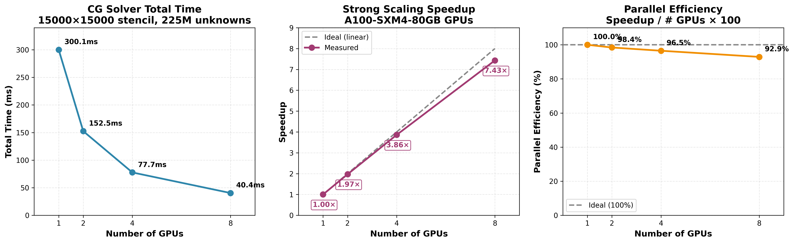
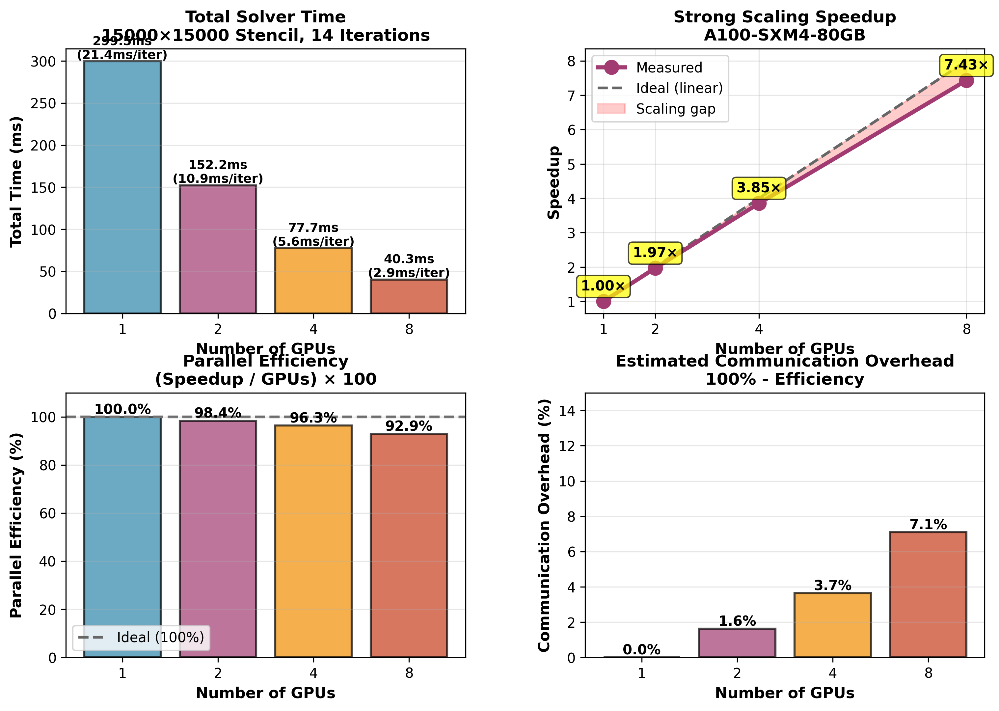
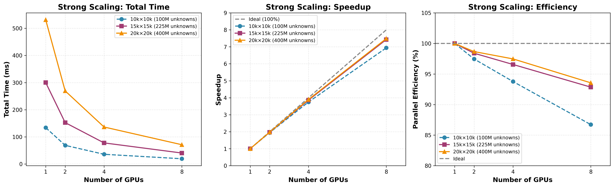
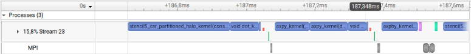
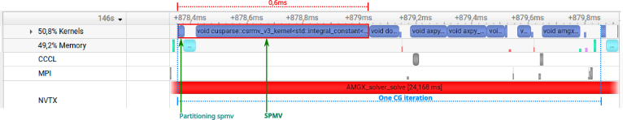

# Multi-GPU Conjugate Gradient Solver

[](https://github.com/1fni/cuda-spmv-benchmark/actions/workflows/ci.yml)
[](https://opensource.org/licenses/MIT)
[](https://developer.nvidia.com/cuda-toolkit)

High-performance multi-GPU Conjugate Gradient solver for large-scale sparse linear systems using CUDA and MPI. Optimized for structured stencil grids with excellent strong scaling efficiency.

## TL;DR — Key Numbers

| Metric | Result |
|--------|--------|
| **Stencil CG vs NVIDIA AmgX** | 1.40× faster (single-GPU), 1.44× faster (8 GPUs) |
| **Stencil SpMV vs cuSPARSE CSR** | 2.07× speedup on A100 80GB |
| **Strong scaling efficiency** | 87–94% from 1→8 GPUs |
| **Problem size tested** | Up to 400M unknowns (20k×20k stencil) |

**Hardware**: 8× NVIDIA A100-SXM4-80GB · CUDA 12.8 · Driver 575.57

---

## Performance Summary

Exploiting stencil structure enables consistent performance gains over generic sparse solvers, from single-GPU to multi-GPU.

| Configuration        | Custom Stencil CG | NVIDIA AmgX CG | Speedup   |
|----------------------|------------------:|---------------:|----------:|
| Single-GPU (20k×20k) |          531.4 ms |       746.7 ms | **1.40×** |
| 8 GPUs (20k×20k)     |           71.0 ms |       102.3 ms | **1.44×** |

<p align="center">
  
</p>

- **SpMV kernel**: 2.07× faster than cuSPARSE CSR (single-GPU)
- **CG solver**: 1.40× faster than NVIDIA AmgX (single-GPU, same convergence)
- **Multi-GPU CG**: 1.44× faster than NVIDIA AmgX (8 GPUs, equivalent scaling)

**Key insight**: Generic solvers cannot exploit known stencil structure for memory access and communication minimization, leading to systematic overhead even when scaling efficiently.

---

## Performance Highlights

**Multi-GPU Strong Scaling** on 8× NVIDIA A100-SXM4-80GB

| Problem Size | 1 GPU | 8 GPUs | Speedup | Efficiency |
|--------------|-------|--------|---------|------------|
| **100M unknowns** (10k×10k stencil) | 133.9 ms | 19.3 ms | 6.94× | 86.8% |
| **225M unknowns** (15k×15k stencil) | 300.1 ms | 40.4 ms | 7.43× | 92.9% |
| **400M unknowns** (20k×20k stencil) | 531.4 ms | 71.0 ms | **7.48×** | **93.5%** |

**Key Results:**
- **7.48× speedup** on 400M unknowns with 8 GPUs (93.5% parallel efficiency)
- **Near-linear 2-GPU scaling**: 1.95-1.97× speedup (97-99% efficiency)
- **Deterministic convergence**: All configurations converge in exactly 14 iterations
- **Better scaling with larger problems**: Efficiency improves from 86.8% to 93.5%

### Strong Scaling Visualization

<p align="center">
  
</p>

<details>
<summary><b>📊 Detailed Analysis</b></summary>

<p align="center">
  
</p>

**Performance breakdown:**
- SpMV kernel time scales near-linearly with GPU count
- MPI communication overhead remains < 10% at 8 GPUs
- Reductions (cuBLAS dot products) maintain high efficiency
- Larger problems amortize communication cost more effectively

</details>

<details>
<summary><b>📈 Problem Size Scaling</b></summary>

<p align="center">
  
</p>

**Observations:**
- 20k×20k matrix achieves best parallel efficiency (93.5%)
- Communication overhead decreases relative to computation for larger problems
- All problem sizes maintain > 85% efficiency at 8 GPUs

See [detailed problem size analysis](docs/PROBLEM_SIZE_SCALING_RESULTS.md) for complete results.

</details>

### Single-GPU SpMV Performance

**Format Comparison** on NVIDIA A100 80GB PCIe

<p align="center">
  
</p>

| Matrix Size | CSR (cuSPARSE) | STENCIL5 (Custom) | Speedup | Bandwidth Improvement |
|-------------|----------------|-------------------|---------|----------------------|
| **10k×10k** (100M unknowns) | 6.77 ms | 3.25 ms | **2.08×** | 1.98× (1182 → 2339 GB/s) |
| **15k×15k** (225M unknowns) | 15.00 ms | 7.29 ms | **2.06×** | 1.96× (1200 → 2346 GB/s) |
| **20k×20k** (400M unknowns) | 26.77 ms | 12.86 ms | **2.08×** | 1.98× (1195 → 2364 GB/s) |

**Key Results:**
- **2.07× average speedup** over cuSPARSE CSR implementation
- **~310 GFLOPS sustained** across all problem sizes (STENCIL5)
- **1.97× bandwidth improvement** through optimized memory access patterns
- **Consistent performance scaling**: Speedup stable at 2.06-2.08× from 100M to 400M unknowns

<details>
<summary><b>📊 Detailed Format Analysis</b></summary>

**Optimization techniques:**
- **Grouped memory accesses**: W-C-E (stride-1) before N-S (stride grid_size) for cache efficiency
- **ELLPACK-based storage**: Exploit stencil structure to eliminate col_idx indirection
- **Interior point fast path**: Direct calculation for 95% of rows (no CSR traversal)
- **Boundary fallback**: Standard CSR traversal for edge cases

**Why STENCIL5 is faster:**
1. Predictable access pattern → better L1/L2 cache utilization
2. Reduced memory traffic (no column index lookups for interior points)
3. Coalesced memory accesses for contiguous elements
4. **Granularity-matched parallelism** (see below)

**Kernel design choice — registers over shared memory:**

With only 5 non-zeros per row, the kernel uses **one thread per row with register-only computation**:
```
5 global loads → registers → 5 FMAs → 1 global store
```

This avoids:
- **Shared memory staging**: Copy overhead exceeds compute for 5 elements
- **Warp-level reductions**: 27 of 32 lanes would be idle; shuffle latency adds no value
- **Synchronization barriers**: No `__syncthreads()` needed

cuSPARSE must handle arbitrary sparsity (1-1000+ nnz/row), so it uses warp-per-row with generic reductions. For fixed 5-point stencils, the simpler approach wins.

> *Low per-row workload → registers beat shared memory.*

**Format choice — CSR over diagonal formats:**

The stencil optimization operates directly on CSR without converting to DIA/ELL/SELL formats. While diagonal formats can be efficient for regular matrices on single-GPU, they become impractical under multi-GPU domain decomposition:

- **Preserved interoperability**: CSR is the standard format for PETSc, Trilinos, AmgX, cuSPARSE, SciPy
- **No conversion overhead**: Direct integration with existing sparse workflows
- **Partition-friendly**: Row-band decomposition maps naturally to CSR; diagonal offsets break across boundaries
- **Drop-in integration**: Works with standard `.mtx` files and halo exchange patterns

> *Optimized stencil SpMV without abandoning CSR or domain decomposition flexibility.*

</details>

### Comparison with NVIDIA AmgX

AmgX is NVIDIA's production-grade multi-GPU solver library, used here as reference implementation. To run AmgX benchmarks: `./scripts/setup/full_setup.sh --amgx` (see [AmgX build instructions](external/benchmarks/amgx/README.md)).

**Hardware**: 8× NVIDIA A100-SXM4-80GB · CUDA 12.8 · Driver 575.57 (same configuration for both solvers)

<p align="center">
  
</p>

| Matrix Size     | Implementation  |    1 GPU |   8 GPUs | Speedup | Efficiency |
|-----------------|-----------------|----------|----------|---------|------------|
| **10k×10k**     | Custom CG       | 133.9 ms |  19.3 ms |   6.94× |      86.8% |
| (100M unknowns) | NVIDIA AmgX     | 188.7 ms |  27.0 ms |   6.99× |      87.4% |
|                 |                 |          |          |         |            |
| **15k×15k**     | Custom CG       | 300.1 ms |  40.4 ms |   7.43× |      92.9% |
| (225M unknowns) | NVIDIA AmgX     | 420.0 ms |  57.0 ms |   7.36× |      92.0% |
|                 |                 |          |          |         |            |
| **20k×20k**     | Custom CG       | 531.4 ms |  71.0 ms |   7.48× |      93.5% |
| (400M unknowns) | NVIDIA AmgX     | 746.7 ms | 102.3 ms |   7.30× |      91.3% |

**Key Findings:**
- **~40% faster at every scale**: Custom CG outperforms AmgX on both single-GPU and 8 GPUs
- **Same convergence**: Both solvers converge in 14 iterations with identical tolerance
- **Similar scaling efficiency**: 87-94% for both implementations

**Why the performance difference?**

> **TL;DR:** SpMV dominates CG performance. A stencil-aware kernel improves memory efficiency, yielding faster iterations without relying on communication overlap.

Profiling reveals that AmgX spends **48% of compute time in generic CSR SpMV**. By exploiting the known 5-point stencil structure, the custom kernel achieves 2× higher throughput—translating to 1.4× overall solver speedup.

### Timeline Comparison (Nsight Systems)

**Custom CG** — Stencil SpMV executes faster:
<p align="center">
  
</p>

**NVIDIA AmgX** — Generic CSR SpMV takes longer:
<p align="center">
  
</p>

<sub>**Figure 1** — Nsight Systems timeline of one Conjugate Gradient iteration (2 MPI ranks, A100 GPU). Top: custom CG using stencil-optimized CSR SpMV. Bottom: NVIDIA AmgX under the same configuration. CUDA HW tracks show actual GPU kernel execution, MPI tracks highlight halo exchange phases. Although halo exchanges are synchronous in both cases, the custom implementation achieves shorter iteration time due to a faster SpMV kernel and reduced communication volume.</sub>

<sub>*NVTX ranges denote algorithmic phases and do not necessarily correspond to exact GPU kernel execution time; CUDA HW tracks provide the authoritative timing.*</sub>

### Why the SpMV Difference (Roofline)

<p align="center">
  
</p>

<sub>**Figure 2** — Roofline analysis of SpMV kernels on NVIDIA A100. Both kernels are memory-bound (positioned on the bandwidth roof). The custom stencil kernel achieves **95% memory throughput** vs 67% for cuSPARSE CSR. Performance gains come from improved memory access patterns and reduced indirections, not increased arithmetic intensity.</sub>

<details>
<summary><b>📊 Detailed Kernel Breakdown</b></summary>

| Kernel Type | AmgX | Custom CG |
|-------------|-----:|----------:|
| SpMV | 48% | 41% |
| AXPY/AXPBY | 28% | 42% |
| Dot products | 10% | 16% |
| Other | 14% | <1% |

**Key optimizations:**
- **No index indirection**: Column indices computed from row index
- **Minimal halo exchange**: 160 KB per neighbor vs 800 MB with AllGather
- **Grouped memory accesses**: W-C-E (stride-1) then N-S (stride grid_size)

</details>

Performance gains come from a more efficient SpMV kernel and reduced communication volume—not from compute-communication overlap. This is not a limitation of AmgX; it correctly handles arbitrary sparse matrices. The gap reflects the benefit of specialization when problem structure is known.

See [Profiling Analysis](docs/PROFILING_ANALYSIS.md) for complete methodology and [`external/benchmarks/amgx/BENCHMARK_RESULTS.md`](external/benchmarks/amgx/BENCHMARK_RESULTS.md) for AmgX details.

---

## Methodology

**How results were measured:**

| Parameter | Value |
|-----------|-------|
| Runs per configuration | 10 (median reported) |
| Warmup runs | 3 (discarded) |
| Timing scope | Solver only (excludes I/O, matrix setup) |
| Convergence criterion | Relative residual < 1e-6 |
| Profiling tools | Nsight Systems (timeline), Nsight Compute (roofline) |

**Compilation flags** (release build):
```
nvcc -O2 --ptxas-options=-O2 --ptxas-options=-allow-expensive-optimizations=true -std=c++11
```

**Reproducibility — One Command:**
```bash
# Full benchmarks (1000×1000 matrix)
./scripts/run_all.sh

# Quick verification (512×512, ~2 min)
./scripts/run_all.sh --quick

# Custom matrix size
./scripts/run_all.sh --size=10000

# Generate figures from results
pip install -r scripts/plotting/requirements.txt
python scripts/plotting/plot_results.py
```

Results are saved to `results/raw/` (TXT) and `results/json/` (structured data).

---

## Technical Highlights

### Multi-GPU Architecture
- **MPI explicit staging**: D2H → MPI_Isend/Irecv → H2D for low-latency halo exchange
- **Row-band partitioning**: 1D decomposition with CSR format and halo zone exchange
- **Efficient reductions**: cuBLAS dot products instead of atomics (238× faster)
- **Optimized for A100**: Takes advantage of NVLink/PCIe Gen4 bandwidth

### Algorithm Features
- **Conjugate Gradient (CG)**: Iterative Krylov method for symmetric positive definite systems
- **5-point stencil**: Custom CUDA kernels for finite difference discretizations
- **Halo exchange**: Minimal communication (160 KB per exchange for 10k grid)
- **Convergence criterion**: Relative residual < 1e-6

### Performance Engineering
- **Compared NCCL vs MPI**: MPI staging 43% faster for small repeated messages
- **Profiling-driven**: Nsight Systems analysis to identify bottlenecks
- **Numerical stability**: Deterministic results across all GPU counts
- **Fair benchmarking**: Unified compilation flags (-O2) and consistent test methodology

---

## Quick Start

### Prerequisites
- **Hardware**: NVIDIA GPUs with Compute Capability ≥ 7.0
- **Software**: CUDA Toolkit ≥ 11.0, OpenMPI or MPICH, C++14 compiler

### Reproduce All Results (One Command)

```bash
git clone https://github.com/1fni/cuda-spmv-benchmark.git
cd cuda-spmv-benchmark

# Setup (auto-detects GPU, installs dependencies)
./scripts/setup/full_setup.sh            # Basic setup
./scripts/setup/full_setup.sh --amgx     # With AmgX comparison (optional, ~15 min build)

# Run benchmarks (auto-detects AmgX if installed)
./scripts/run_all.sh

# Options
./scripts/run_all.sh --quick             # Quick verification (~2 min)
./scripts/run_all.sh --size=10000        # Custom matrix size
```

### Manual Build and Run

```bash
# Build all (spmv_bench, cg_solver_mgpu_stencil) - requires MPI
make

# Build AmgX benchmarks (requires AmgX installed)
make -C external/benchmarks/amgx

# Generate 5-point stencil matrix
./bin/generate_matrix 1000 matrix/stencil_1k.mtx
```

```bash
# SpMV benchmark (single-GPU)
./bin/spmv_bench matrix/stencil_1k.mtx --mode=cusparse-csr,stencil5-csr

# CG solver (single-GPU)
mpirun -np 1 ./bin/cg_solver_mgpu_stencil matrix/stencil_1k.mtx

# CG solver (multi-GPU)
mpirun -np 2 ./bin/cg_solver_mgpu_stencil matrix/stencil_1k.mtx

# AmgX comparison (if installed)
./external/benchmarks/amgx/amgx_cg_solver matrix/stencil_1k.mtx
mpirun -np 2 ./external/benchmarks/amgx/amgx_cg_solver_mgpu matrix/stencil_1k.mtx
```

---

## Architecture Overview

### Communication Pattern

```
Row-band partitioning (8 GPUs, 10k×10k grid):

GPU 0: rows [0, 12.5k)       ┐
GPU 1: rows [12.5k, 25k)     │
GPU 2: rows [25k, 37.5k)     │  Halo exchange:
GPU 3: rows [37.5k, 50k)     │  - 160 KB per GPU
GPU 4: rows [50k, 62.5k)     │  - MPI_Isend/Irecv
GPU 5: rows [62.5k, 75k)     │  - ~2 ms latency
GPU 6: rows [75k, 87.5k)     │
GPU 7: rows [87.5k, 100k)    ┘
```

### CG Algorithm Structure

```c
1. Initial setup:
   - Partition matrix rows across GPUs
   - Exchange halo zones for initial vectors (x, r)

2. CG iteration loop (14 iterations):
   a. SpMV: y = A×p (with halo exchange)
   b. Dot products: α = (r,r)/(p,y)  [MPI_Allreduce]
   c. AXPY updates: x += α×p, r -= α×y
   d. Dot products: β = (r_new,r_new)/(r_old,r_old)  [MPI_Allreduce]
   e. Vector update: p = r + β×p
   f. Convergence check: ||r||/||b|| < 1e-6

3. Gather final solution to all ranks
```

**Performance characteristics:**
- **SpMV dominates** (~40-50% of total time)
- **BLAS1 operations** (AXPY, dot products): ~40-45%
- **Reductions** (MPI_Allreduce): ~10-15%
- **Halo exchange**: < 5% for large problems

---

## Repository Structure

```
├── README.md                       # This file
├── scripts/
│   ├── run_all.sh                  # ONE COMMAND to reproduce all results
│   ├── benchmarking/               # Individual benchmark scripts
│   └── plotting/                   # Python visualization (matplotlib)
├── results/
│   ├── raw/                        # Raw benchmark outputs (TXT)
│   ├── json/                       # Structured results (JSON)
│   └── figures/                    # Generated plots (PNG)
├── profiling/
│   ├── nsys/                       # Nsight Systems timeline profiles
│   ├── ncu/                        # Nsight Compute roofline analysis
│   └── images/                     # Exported screenshots
├── src/                            # Source code
│   ├── main/                       # Entry points
│   ├── solvers/                    # CG solver implementations
│   ├── spmv/                       # SpMV kernels
│   ├── matrix/                     # Stencil Matrix Market generator
│   └── io/                         # Matrix I/O
├── include/                        # Header files
├── docs/                           # Documentation & pre-generated figures
├── external/benchmarks/amgx/       # NVIDIA AmgX comparison
└── tests/                          # Unit tests (Google Test)
```

---

## Documentation

- **[Profiling Analysis](docs/PROFILING_ANALYSIS.md)**: Why stencil specialization wins — kernel breakdown, roofline analysis, speedup attribution
- **[Strong Scaling Results](docs/SHOWCASE_SCALING_RESULTS.md)**: Detailed analysis of 15k×15k scaling
- **[Problem Size Scaling](docs/PROBLEM_SIZE_SCALING_RESULTS.md)**: Multi-size benchmark results
- **[Performance Summary](docs/scaling_summary.md)**: Technical metrics and talking points
- **[API Documentation](docs/API.md)**: Code structure and operator interface

---

## Benchmarking

### One Command

```bash
./scripts/run_all.sh
```

This builds all components, runs benchmarks, and saves results to:
- `results/raw/` — Raw TXT outputs
- `results/json/` — Structured JSON data
- `results/figures/` — Generated plots (after running plotting script)

### Custom Benchmarks

```bash
# Single configuration with JSON export
mpirun -np 2 ./bin/cg_solver_mgpu_stencil matrix/stencil_1k.mtx --json=custom.json

# Extract timing from JSON
jq '.timing.median_ms' custom.json
```

### Profiling with Nsight Systems

```bash
# Profile solver iterations only (excludes setup/teardown)
nsys profile --trace=cuda,mpi,nvtx --capture-range=nvtx --nvtx-capture="solver_iteration" \
  mpirun -np 2 ./bin/cg_solver_mgpu_stencil matrix/stencil_1k.mtx

# View timeline in GUI
nsys-ui report.nsys-rep
```

---

## Development

### Build System

**Dual build approach** for flexibility:
- **Makefile**: Primary build for CUDA/MPI binaries
- **CMake**: Testing framework with Google Test

```bash
# Release build (default)
make

# Debug build with GPU debugging (-g -G)
make BUILD_TYPE=debug

# Build specific targets
make cg_solver_mgpu_stencil
make generate_matrix

# Run tests
cd tests && mkdir build && cd build
cmake .. && make && ./test_runner
```

### Adding Features

1. **New SpMV kernel**: Implement in `src/spmv/`, register in `get_operator()`
2. **New solver**: Add to `src/solvers/`, create entry point in `src/main/`
3. **Performance metrics**: Extend `benchmark_stats_mgpu_partitioned.cu`

### Testing

```bash
# All tests
./test_runner

# Specific test suite
./test_runner --gtest_filter="PartitionedSolver*"
```

---

## Requirements

- **NVIDIA GPUs**: Compute Capability ≥ 7.0 (Volta, Turing, Ampere, Hopper)
- **CUDA Toolkit**: ≥ 11.0 with cuSPARSE and cuBLAS libraries
- **MPI Implementation**: OpenMPI ≥ 4.0 or MPICH ≥ 3.3
- **C++ Compiler**: Supporting C++14 (nvcc, g++, clang++)
- **Optional**: Nsight Systems/Compute for profiling

**Tested configurations:**
- NVIDIA A100-SXM4-80GB (8 GPUs) - Primary development
- NVIDIA RTX 3090 (2 GPUs) - Validation
- NVIDIA H100 NVL (single GPU) - Compatibility

---

## Citation

If you use this code in your research, please cite:

```bibtex
@software{mgpu_cg_solver,
  author = {Bouhrour, Stephane},
  title = {Multi-GPU Conjugate Gradient Solver with MPI},
  year = {2026},
  url = {https://github.com/1fni/cuda-spmv-benchmark},
  note = {7.48× speedup on 400M unknowns with 8 A100 GPUs}
}
```

---

## License

MIT License - See [LICENSE](LICENSE) file for details.

---

## Contact

**Stephane Bouhrour**
Email: bouhrour.stephane@gmail.com
GitHub: [@1fni](https://github.com/1fni)

For questions, issues, or collaboration opportunities, please open an issue on GitHub.
