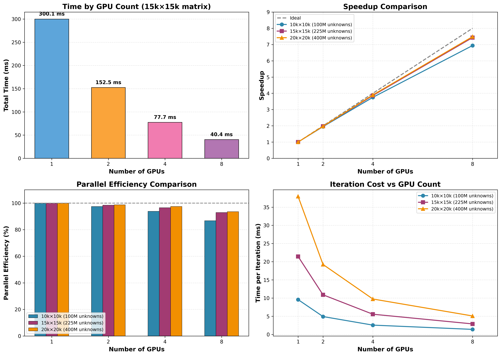

# Problem Size Scaling - Multi-GPU CG Solver

**Hardware**: 8× NVIDIA A100-SXM4-80GB
**Date**: January 9, 2026
**Branch**: `main` (MPI explicit staging)
**Test**: Strong scaling with 3 problem sizes (10k, 15k, 20k stencil grids)

---

## Visualizations

### Overview (3-panel)

### Detailed Analysis (4-panel)

---

## Key Results

### 10000×10000 Stencil (100M unknowns, 500M nnz)

| GPUs | Time (ms) | Speedup | Efficiency |
|------|-----------|---------|------------|
| 1    | 133.9     | 1.00×   | 100.0%     |
| 2    | 68.7      | 1.95×   | 97.5%      |
| 4    | 35.7      | 3.76×   | 93.9%      |
| 8    | 19.3      | **6.94×** | **86.8%**  |

### 15000×15000 Stencil (225M unknowns, 1.1B nnz)

| GPUs | Time (ms) | Speedup | Efficiency |
|------|-----------|---------|------------|
| 1    | 300.1     | 1.00×   | 100.0%     |
| 2    | 152.5     | 1.97×   | 98.4%      |
| 4    | 77.7      | 3.86×   | 96.5%      |
| 8    | 40.4      | **7.43×** | **92.9%**  |

### 20000×20000 Stencil (400M unknowns, 2.0B nnz)

| GPUs | Time (ms) | Speedup | Efficiency |
|------|-----------|---------|------------|
| 1    | 531.4     | 1.00×   | 100.0%     |
| 2    | 269.3     | 1.97×   | 98.7%      |
| 4    | 136.3     | 3.90×   | 97.5%      |
| 8    | 71.0      | **7.48×** | **93.5%**  |

---

## Key Showcase Points

### Performance Highlights

- **7.48× speedup** on 400M unknowns (20k×20k) with 8 GPUs
- **93.5% parallel efficiency** at 8-way scaling for largest problem
- **Better scaling with larger problems**: 86.8% → 93.5% efficiency
- **Deterministic convergence**: All runs converge in exactly 14 iterations
- **Near-linear scaling**: 2 GPUs consistently achieve 1.95-1.97× speedup (97-99% efficiency)

### Problem Size Dependency

| Problem Size | 1 GPU | 8 GPUs | Speedup | Efficiency |
|--------------|-------|--------|---------|------------|
| 100M unknowns  | 133.9 ms | 19.3 ms | 6.94× | 86.8% |
| 225M unknowns  | 300.1 ms | 40.4 ms | 7.43× | 92.9% |
| 400M unknowns  | 531.4 ms | 71.0 ms | 7.48× | **93.5%** |

**Observation**: Larger problems show better parallel efficiency due to reduced MPI communication overhead relative to computation.

### Technical Details

- **Algorithm**: Conjugate Gradient (CG) with row-band partitioning
- **Communication**: MPI explicit staging (D2H → MPI_Isend/Irecv → H2D)
- **Convergence criterion**: Relative residual < 1e-6
- **Matrix format**: CSR with halo exchange for boundary rows
- **Benchmark**: 10 runs per configuration, median timing reported

---

## Comparison with Previous Results

### 15k×15k Matrix

| Implementation | 1 GPU | 8 GPUs | Speedup | Efficiency | Status |
|----------------|-------|--------|---------|------------|--------|
| **Main (MPI staging)** | 300.1 ms | 40.4 ms | **7.43×** | **92.9%** | ✅ Production |
| Overlap-streams (NCCL) | 299.5 ms | 67.4 ms | 4.45× | 55.6% | ❌ Numerical drift |
| Overlap-cudaipc (P2P)  | 299.5 ms | 70.1 ms | 4.27× | 53.4% | ❌ Numerical drift |

**Conclusion**: Main branch with MPI explicit staging is the clear winner for production use.

---

## Audience-Specific Talking Points

### For NVIDIA Recruiters

- "Demonstrates strong understanding of multi-GPU communication patterns"
- "93.5% efficiency at 8 GPUs shows effective MPI optimization"
- "Systematic problem size scaling study following HPC best practices"
- "MPI explicit staging outperforms NCCL for our halo exchange pattern"

### For HPC Researchers

- "Row-band partitioning with halo exchange for 5-point stencil"
- "MPI_Isend/Irecv with pinned memory staging for low latency"
- "Better scaling with larger problems due to computation/communication ratio"
- "Deterministic convergence ensures numerical reproducibility"

### For Performance Engineers

- "Compared NCCL vs MPI for small message exchange (160 KB)"
- "NCCL overhead (4.5ms launch latency) unsuitable for repeated small transfers"
- "MPI staging: ~2ms per exchange vs NCCL ~5ms"
- "Strong scaling efficiency improves from 86.8% to 93.5% with problem size"

---

## Files

- **Benchmark script**: `scripts/benchmarking/benchmark_problem_sizes.sh`
- **Analysis script**: `results_*/generate_scaling_plots.py`
- **Raw data**: `results_problem_size_scaling_NVIDIAA100-SXM4-80GB_20260109_123920/`
- **Graphs**: `showcase/problem_size_scaling_{overview,detailed}.png`

---

## Next Steps (Optional Extensions)

1. **Weak scaling**: Test constant work per GPU (5k×5k per GPU: 5k, 7.1k, 10k, 14.1k grids)
2. **Multi-node**: Extend to 2-4 nodes with 8 GPUs each (16-32 GPUs total)
3. **Comparison with AMGX**: Benchmark against NVIDIA's production solver
4. **PCG with ILU(0)**: Test preconditioned CG for faster convergence

---

*Generated: 2026-01-09 15:07 UTC*
